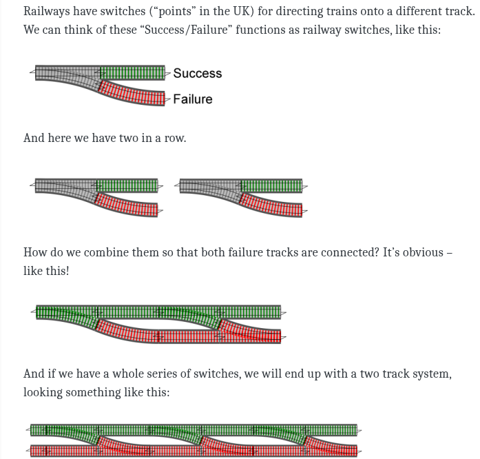

# Eight reasons to try F#
[](https://fsharp.org)
## **Basics**
- Released (1.0) by Microsoft Research/Don Syme in 2005
- Supported in Visual Studio 2010
- .NET language (compiles to IL) 
- ML family (OCaml, Haskell, Rust, etc.)
- Functional (First class functions, immutability, etc.)
- Object-oriented
- Indentation based syntax (No braces, no semicolons)
- Linear compiler
- Partial application
  ```fsharp
  let add x y = x + y
  let f = add 2
  f 3 // 5
  ```
- Pipe operator
  ```fsharp
  3 |> add 2 |> add 5 // 10        
  ```
## **Type Inference** (Hindley-Milner type system)
"Python with types"
## **Railway Oriented Programming**

## **Computation Expressions**
async/await, LINQ, list comprehensions all in one!
## **Union Types**/**Active Patterns**
Typed switch statements
## **Tail Recursion**
A better way to loop
## **Mailbox Processor**
Actors! 
## **Fable**
F# to Javascript!
## (Bonus) **Type Providers** 